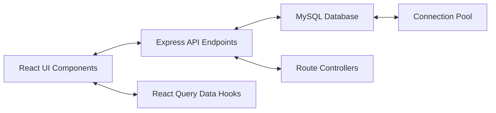
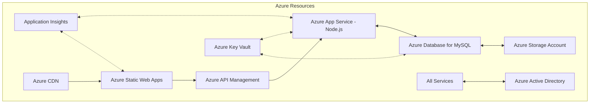

# UN-Habitat Project Management Dashboard


A full-stack application for managing and visualizing UN-Habitat projects, built with a modern JavaScript/TypeScript stack. The frontend leverages React, Vite, and TypeScript with Tailwind CSS for styling and Recharts for data visualization. The backend utilizes Node.js with Express for the API server, MySQL for data persistence, with a robust architecture supporting RESTful endpoints and efficient data operations. This comprehensive dashboard provides tools for project management, data visualization, and detailed analysis of UN-Habitat initiatives around the world using the data provided in excel format.

## Table of Contents

- [Features](#features)
- [Technology Stack](#technology-stack)
- [Architecture and Implementation Details](#architecture-and-implementation-details)
- [Project Structure](#project-structure)
- [Prerequisites](#prerequisites)
- [Setup Instructions](#setup-instructions)
- [Running the Application](#running-the-application)
- [Data Management](#data-management)
- [API Documentation](#api-documentation)
- [Project Highlights](#project-highlights)
- [Future Enhancements](#future-enhancements)
- [Deployment Considerations](#deployment-considerations)

## Features

- **Interactive Dashboard**
  - Visual analytics with charts and graphs for project distribution
  - Statistics by country, theme, and organizational unit
  - Summary metrics for project counts, budgets, and statuses
  
- **Comprehensive Project Management**
  - Full CRUD operations (Create, Read, Update, Delete)
  - Filtering by approval status, country, and search terms
  - Detailed project views with all associated information
  
- **Data Visualization**
  - Bar charts for geographic and organizational distribution
  - Pie charts for thematic analysis
  - Interactive legends and tooltips for enhanced data exploration
  
- **Robust Backend System**
  - RESTful API architecture
  - Relational database design with proper normalization
  - Automatic data import from Excel sources
  
- **Responsive UI**
  - Mobile-friendly interface using modern design principles
  - Consistent styling across all components
  - Accessible UI elements following best practices

## Technology Stack

### Frontend

- **React 18+**: Modern component-based UI library for building dynamic user interfaces
- **TypeScript**: Type-safe JavaScript superset providing improved developer experience and code reliability
- **Vite**: Next-generation frontend tooling with fast HMR (Hot Module Replacement) and optimized builds
- **Recharts**: Composable charting library for React used for all data visualizations including bar charts, pie charts and more
- **TanStack Query (React Query)**: Data fetching, caching, and state management library for efficient API integration
- **Shadcn UI**: Beautifully designed components built with Radix UI primitives for accessible interfaces
- **Tailwind CSS**: Utility-first CSS framework enabling rapid UI development with consistent design language
- **React Hook Form**: Form management with validation integration through Zod
- **React Router**: Client-side routing library for navigation between pages
- **date-fns**: Modern JavaScript date utility library

### Backend

- **Node.js**: JavaScript runtime environment for executing server-side code
- **Express**: Minimal and flexible Node.js web application framework providing robust routing and middleware architecture
- **MySQL**: Relational database management system for structured data storage
- **mysql2**: Modern MySQL client for Node.js with Promise support
- **XLSX**: Library for parsing and generating Excel files, used for data import
- **dotenv**: Environment variables management for configuration
- **cors**: Cross-Origin Resource Sharing middleware for secure API access
- **helmet**: Security middleware adding various HTTP headers for protection
- **morgan**: HTTP request logger middleware for debugging and monitoring

### Data Storage

- **Normalized Schema**: Properly normalized tables with relationships
- **Junction Tables**: Many-to-many relationship handling for projects, countries, themes, and donors
- **Transactions**: ACID-compliant operations for data integrity

### Development Tools

- **ESLint**: Code linting for consistent coding standards
- **Concurrently**: Run multiple commands concurrently for integrated development workflow
- **Nodemon**: Monitor for changes and automatically restart Node.js applications during development
- **Bash Scripts**: Custom shell scripts for setup, database initialization, and application startup
- **npm Scripts**: Custom commands for development, building, and deployment tasks

## Architecture and Implementation Details

### Node.js Backend Architecture

The backend is built on Node.js with Express, following a modular architecture pattern:

1. **Server Configuration** (`server.js`):
   - Implements a robust Express server with security middleware (Helmet)
   - Configures CORS for API access from the React frontend
   - Sets up structured logging with Morgan
   - Defines API routing and static file serving
   - Supports both development and production environments

2. **Database Management**:
   - Connection pooling with `mysql2/promise` for efficient database operations
   - Environment-based configuration with dotenv
   - Parameterized queries to prevent SQL injection
   - Transaction support for maintaining data integrity

3. **API Structure**:
   - RESTful endpoint organization by resource type (projects, countries, themes, donors)
   - Consistent error handling patterns
   - Sophisticated query building for complex data relationships
   - Support for filtering, pagination, and search operations

4. **Data Import System**:
   - Automated Excel parsing and database population
   - Multi-valued field handling (splitting by delimiters)
   - Date format normalization
   - Validation and error handling during import

### Data Flow Architecture



### Security Implementation

- **API Security**: Implementation of Helmet middleware to set security-related HTTP headers
- **CORS Configuration**: Controlled cross-origin resource sharing
- **Query Safety**: Parameterized queries to prevent SQL injection attacks
- **Environment Variables**: Secure credential management with dotenv
- **Input Validation**: Server-side validation for all incoming request data

### Node.js Specific Implementations

- **ES Modules**: Modern JavaScript module system used throughout the backend
- **Async/Await Pattern**: Asynchronous programming model for database operations and API handling
- **Middleware Architecture**: Composition-based Express middleware for request processing pipeline
- **Connection Pooling**: Efficient database connection management for optimal performance
- **Script Automation**: Node.js scripts for database setup, data import, and maintenance tasks

### Backend Performance Optimizations

1. **Database Query Optimization**
   - Efficient SQL queries with appropriate indexing
   - Group concatenation for related entities (projects, countries, themes)
   - Prepared statements for query reuse

2. **Resource Management**
   - Connection pooling for efficient database access
   - Proper error handling and resource cleanup
   - Memory leak prevention through careful promise management

3. **API Response Optimization**
   - Pagination support for large data sets
   - Optional field filtering
   - Appropriate HTTP status codes and error responses

## Project Structure

```plaintext
un-habitat-app/
├── db/                        # Database connection module
├── public/                    # Public assets and Excel data file
├── routes/                    # Backend API routes
│   └── api/                   # API endpoints
│       ├── countries.js
│       ├── donors.js
│       ├── projects.js
│       └── themes.js
├── src/                       # Frontend source code
│   ├── components/            # React components
│   │   ├── Dashboard/         # Dashboard-related components
│   │   ├── Layout/            # Layout components
│   │   ├── Projects/          # Project management components
│   │   └── ui/                # UI components (Shadcn)
│   ├── hooks/                 # Custom React hooks
│   ├── lib/                   # Utility functions
│   ├── pages/                 # Page components
│   └── services/              # API service layer
├── .env.local                 # Environment variables
├── import-excel-to-mysql.js   # Data import script
├── package.json               # Project dependencies
├── server.js                  # Express server entry point
├── setup-database.js          # Database setup script
├── setup-server.sh            # Server setup shell script
├── start-app.sh               # Application startup script
└── unhabitat.sql              # Database dump file
```

## Prerequisites

- Node.js (v16+)
- MySQL (v8+)
- npm or yarn
- bash shell (for setup scripts)

## Setup Instructions

### 1. Clone the Repository

```bash
git clone https://github.com/Faqih001/un-habitat-app.git
cd un-habitat-app
```

### 2. Configure Environment Variables

Create a `.env.local` file in the project root with your MySQL credentials:

```bash
DB_HOST=localhost
DB_USER=root
DB_PASSWORD=your_password
DB_NAME=unhabitat
```

### 3. Install Frontend Dependencies

```bash
npm install
```

### 4. Setup Backend

Run the server setup script to install backend dependencies:

```bash
./setup-server.sh
```

Follow the prompts to:

- Install server dependencies
- Set up the database schema
- Import data from Excel

Alternatively, you can restore the database from the provided SQL dump:

```bash
mysql -u root -p < unhabitat.sql
```

## Running the Application

### Development Mode (Frontend + Backend)

```bash
npm run dev:full
```

### Run Frontend Only

```bash
npm run dev
```

### Run Backend Only

```bash
npm run server
```

### Access the Application

- **Frontend**: [http://localhost:5173](http://localhost:5173)
- **API**: [http://localhost:3001/api](http://localhost:3001/api)

## Data Management

### Importing Data from Excel

To import data from Excel:

1. Place the Excel file at `public/Application Development - Exam Data.xlsx`
2. Run the import script:

```bash
npm run import-data
```

### Database Setup

To set up the database schema without importing data:

```bash
npm run setup-db
```

To do both steps in one command:

```bash
npm run setup-and-import
```

### Creating a Database Dump

To create a MySQL dump of the database:

```bash
mysqldump -h localhost -u root -p unhabitat > unhabitat.sql
```

## API Documentation

### Projects

- `GET /api/projects/all` - Get all projects (optionally paginated)
- `GET /api/projects/:id` - Get project by ID
- `GET /api/projects/country/:country` - Get projects by country
- `GET /api/projects/status/:status` - Get projects by approval status
- `POST /api/projects` - Create new project
- `PUT /api/projects/:id` - Update project
- `DELETE /api/projects/:id` - Delete project

### Countries, Themes, Donors

- `GET /api/countries` - Get all countries
- `GET /api/countries/:name/projects` - Get projects for a country
- `GET /api/themes` - Get all themes
- `GET /api/themes/:name/projects` - Get projects for a theme
- `GET /api/donors` - Get all donors
- `GET /api/donors/:name/projects` - Get projects for a donor

## Project Highlights

### Database Design

The application uses a carefully designed relational database schema that supports many-to-many relationships:

- Projects can be associated with multiple countries, themes, and donors
- Normalized structure ensures data integrity and minimizes redundancy

### Data Visualization

The dashboard features dynamic charts built with Recharts:

- Bar charts showing project distribution by country
- Pie charts displaying thematic analysis
- Horizontal bar charts for organizational units

### Form Validation

All project management forms implement:

- Field validation using Zod schema
- Error reporting with user-friendly messages
- Data type enforcement

### API Architecture

The backend follows RESTful principles:

- Resource-based endpoints
- HTTP verbs for CRUD operations
- JSON responses with appropriate status codes

## Future Enhancements

- User authentication and authorization
- Advanced filtering and sorting options
- Export functionality to multiple formats
- Dark/light theme toggle
- Unit and integration tests
- Deployment pipeline

## Deployment Considerations

### Containerization

The application can be containerized using Docker for consistent deployment across environments:

```dockerfile
# Example Dockerfile for the application
FROM node:18-alpine as build

WORKDIR /app
COPY package*.json ./
RUN npm ci
COPY . .
RUN npm run build

FROM node:18-alpine as production
WORKDIR /app
COPY --from=build /app/dist ./dist
COPY --from=build /app/server.js ./
COPY --from=build /app/db ./db
COPY --from=build /app/routes ./routes
COPY --from=build /app/package*.json ./
RUN npm ci --production

EXPOSE 3001
CMD ["node", "server.js"]
```

### Azure Deployment Architecture

The UN-Habitat Project Management Dashboard is perfectly suited for deployment on Azure with the following architecture:

#### Architecture Diagram



#### Azure Services Recommendation

1. **Frontend Hosting**
   - **Azure Static Web Apps**: For hosting the React/Vite frontend application
   - **Azure CDN**: For content delivery and caching static assets

2. **Backend Services**
   - **Azure App Service**: For hosting the Node.js/Express API server
     - Web App with Node.js runtime
     - Managed identity for secure service-to-service authentication
   - **Azure API Management**: For API gateway, throttling, and monitoring

3. **Database**
   - **Azure Database for MySQL**: Managed MySQL database service
     - Geo-redundancy for high availability
     - Automated backups and point-in-time restore
     - Firewall rules to restrict access to App Service

4. **Security & Management**
   - **Azure Key Vault**: For storing database credentials and API keys
   - **Azure Active Directory**: For user authentication and role-based access
   - **Azure Application Insights**: For monitoring and analytics
   - **Azure Monitor**: For logging and alerting

5. **DevOps Pipeline**
   - **Azure DevOps**: For CI/CD pipelines
   - **GitHub Actions**: For automated builds and deployments

#### Deployment Steps

1. **Database Setup**

   ```bash
   # Create Azure Database for MySQL
   az mysql server create \
     --resource-group unhabitat-resources \
     --name unhabitat-mysql \
     --location eastus \
     --admin-user mysqluser \
     --admin-password [secure-password] \
     --sku-name GP_Gen5_2
   
   # Create database
   az mysql db create \
     --resource-group unhabitat-resources \
     --server-name unhabitat-mysql \
     --name unhabitat
   ```

2. **App Service Setup**

   ```bash
   # Create App Service Plan
   az appservice plan create \
     --name unhabitat-appservice-plan \
     --resource-group unhabitat-resources \
     --sku B1 \
     --is-linux
   
   # Create Web App for Node.js
   az webapp create \
     --resource-group unhabitat-resources \
     --plan unhabitat-appservice-plan \
     --name unhabitat-api \
     --runtime "NODE|18-lts"
   
   # Set environment variables
   az webapp config appsettings set \
     --resource-group unhabitat-resources \
     --name unhabitat-api \
     --settings \
       DB_HOST=unhabitat-mysql.mysql.database.azure.com \
       DB_NAME=unhabitat \
       DB_USER=mysqluser \
       DB_PASSWORD=@Microsoft.KeyVault(SecretUri=https://unhabitat-kv.vault.azure.net/secrets/mysql-password/version) \
       NODE_ENV=production
   ```

3. **Static Web App for Frontend**

   ```bash
   # Deploy frontend to Static Web Apps
   az staticwebapp create \
     --resource-group unhabitat-resources \
     --name unhabitat-dashboard \
     --source https://github.com/yourusername/un-habitat-app \
     --location eastus2 \
     --branch main \
     --app-location "/" \
     --output-location "dist" \
     --api-location ""
   ```

#### Configuration Best Practices

1. **Security**
   - Enable Azure Managed Identities for passwordless authentication
   - Store all secrets in Azure Key Vault
   - Implement network security groups to restrict traffic
   - Enable Azure Security Center monitoring

2. **Performance**
   - Configure autoscaling rules based on CPU/memory usage
   - Implement Application Insights for performance monitoring
   - Set up staging slots for zero-downtime deployments
   - Configure Connection Pooling for database connections

3. **Cost Management**
   - Use App Service B1 tier for development, scale to higher tiers as needed
   - Configure auto-scale rules to scale down during off-hours
   - Set up cost alerts and budgets
   - Use Azure Advisor for cost optimization recommendations

### Cloud Deployment Options

The application architecture is designed to be cloud-friendly and can be deployed on various platforms:

1. **Azure App Service**:
   - Frontend and backend can be deployed as separate services
   - MySQL can use Azure Database for MySQL
   - Configuration via environment variables

2. **AWS Elastic Beanstalk**:
   - Node.js environment for the backend
   - S3 + CloudFront for the static frontend
   - RDS for MySQL database

3. **Kubernetes Deployment**:
   - Separate pods for frontend and backend
   - Service discovery for internal communication
   - Persistent storage for database

### CI/CD Pipeline

A continuous integration and delivery pipeline can be implemented using:

- GitHub Actions or Azure DevOps for automated builds
- Automated testing before deployment
- Database migration scripts for schema changes
- Staged rollout process with environment promotion

### Scaling Considerations

The application architecture supports horizontal scaling:

- Stateless backend enables multiple server instances
- Connection pooling for database performance
- Cache implementation for frequent queries
- Load balancing for distributing traffic

### Environment Configuration

The application uses environment variables for configuration, making it adaptable to different deployment environments:

```env
# Example production environment configuration
DB_HOST=production-mysql-server
DB_USER=app_user
DB_PASSWORD=secure_password
DB_NAME=unhabitat_prod
PORT=3001
NODE_ENV=production
```

## Technical Summary

The UN-Habitat Project Management Dashboard represents a comprehensive full-stack application showcasing modern web development practices:

### Architecture Highlights

- **Separation of Concerns**: Clear distinction between frontend, backend, and database layers
- **RESTful API Design**: Well-structured API endpoints following REST principles
- **Data Normalization**: Properly designed database schema with junction tables for many-to-many relationships
- **Component-Based UI**: Modular React components with clear responsibilities
- **Responsive Design**: Mobile-first approach with Tailwind CSS

### Technical Achievements

1. **Modern JavaScript/TypeScript Implementation**
   - ES Modules throughout the codebase
   - TypeScript for type safety and developer experience
   - Async/await patterns for asynchronous operations

2. **Efficient Data Management**
   - Automated data import from Excel to MySQL
   - Database connection pooling
   - Parameterized queries for security and performance
   - Proper date handling across different formats

3. **Robust UI Architecture**
   - Component composition for UI building blocks
   - Data visualization with Recharts
   - State management with React Query
   - Form handling with React Hook Form and Zod validation

4. **Development Workflow**
   - Hot Module Replacement with Vite
   - Concurrent development of frontend and backend
   - Automated database setup and data import
   - ESLint for code quality enforcement

This project demonstrates expertise across the full web development stack, from database design and API implementation to responsive UI development and data visualization, with a focus on maintainability, performance, and security.

---

Developed as a showcase of full-stack development skills, data visualization capabilities, and project management expertise using modern JavaScript/TypeScript technologies by Fakii Mohammed.
